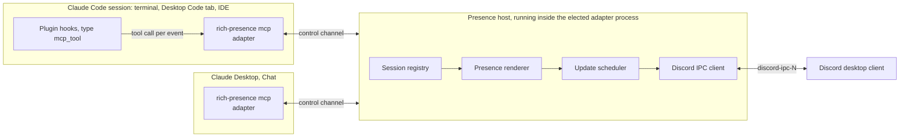
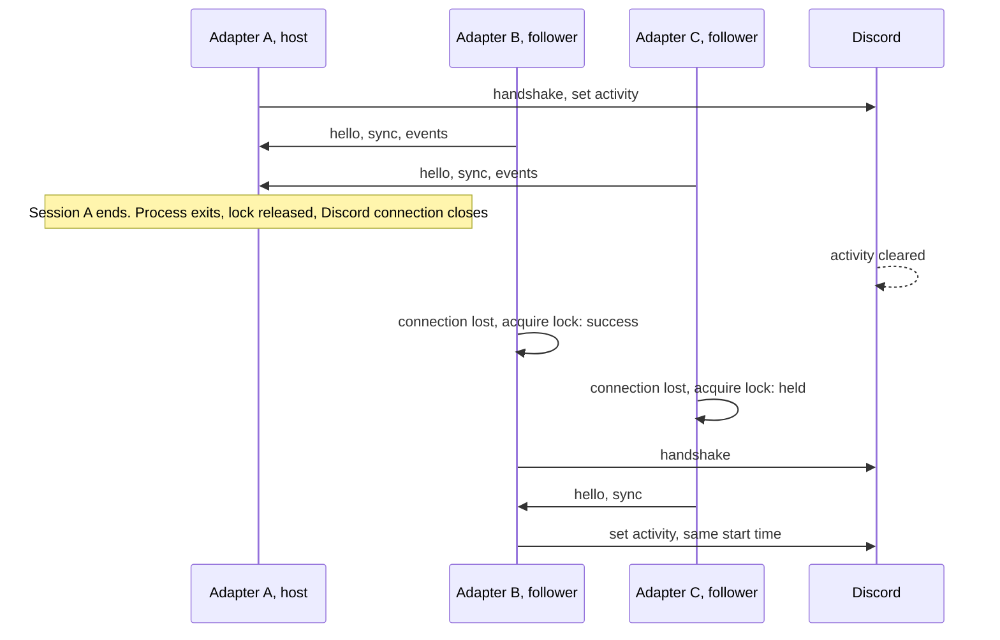
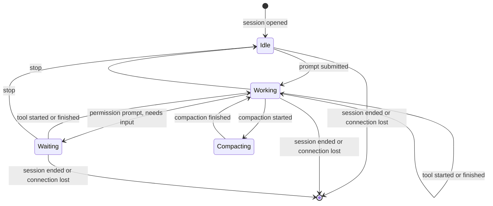

# Architecture

This is the design that the [viability assessment](viability.md) leads to. Each decision has an [ADR](adr/README.md). Where this page and an ADR disagree, the ADR wins.

## Goals

1. Show Claude activity in Discord across Claude Code and Claude Desktop.
2. Never slow, block or break a Claude session.
3. Install without prerequisites: no runtime, no shell, no service.
4. Reveal nothing the user did not choose to reveal.
5. Be fully tested and analysed: 100% statement coverage, SonarQube Cloud.

## Vocabulary

| Term | Meaning |
|---|---|
| Surface | A place Claude runs: `code` (Claude Code in any local form) or `desktop` (Claude Desktop Chat) |
| Adapter | The part of the binary that runs inside a surface as a stdio MCP server and turns that surface's signals into presence events |
| Presence host | The one process per user that owns the session registry and the Discord connection |
| Control channel | The local socket between adapters and the presence host |
| Session | One Claude Code session, or the one Claude Desktop app instance |
| Activity | The payload Discord displays: two text lines, images, a start time |

## System context

Every box labelled `rich-presence` is the same binary. Claude starts it; nothing else does.

## Components

| Component | Responsibility | Pure? |
|---|---|---|
| Domain | Presence events, the session state machine, the registry of open sessions | Yes |
| Presence renderer | Chooses the session to show and builds the activity from registry state and configuration | Yes |
| Update scheduler | Rate limits and coalesces activity updates against an injected clock | Yes |
| Configuration | Defaults, config file, environment overrides, validation | I/O at the edge only |
| Discord codec | Frames, handshake, activity command, response parsing | Yes |
| Discord transport | Finds and dials the Discord pipe or socket on each operating system | I/O |
| Discord session manager | Connects, reconnects with backoff, applies scheduled updates, clears on shutdown | Orchestration over ports |
| Control protocol | Versioned messages between adapters and the host | Yes |
| Control transport | Socket path, listener, dialer, and the lock that elects the host | I/O |
| Host | Election, serving followers, wiring registry to renderer to scheduler to Discord, failover | Orchestration over ports |
| MCP server | The minimal stdio subset: initialise, list tools, call tool, ping | Yes, over injected streams |
| Adapters | `code`: tool calls to events. `desktop`: lifecycle only | Yes |
| CLI | Command dispatch and the composition root | Thin |

"Pure" components take their inputs as values and interfaces and are tested without the operating system. Everything that touches the operating system sits behind a small interface with a real implementation per platform and a fake for tests. This is what makes 100% coverage practical. See [ADR-0001](adr/0001-core-architecture.md) and [quality-strategy.md](quality-strategy.md).

## The presence host

There is no separate daemon. See [ADR-0005](adr/0005-presence-host-election.md).

1. Every adapter process, on start, tries to take an exclusive operating-system lock on a per-user lock file.
2. The one that gets it is the **host**. It listens on the control socket, connects to Discord, and also serves its own session in-process.
3. The others are **followers**. They connect to the control socket and forward events.
4. Each follower keeps the current state of its own session. If its connection to the host drops, it tries for the lock again. One follower wins and becomes host. The rest reconnect and resend their state. Presence is restored from what the adapters hold.

Consequences worth knowing:

- **Nothing outlives Claude.** When the last adapter exits, there is no process left.
- **A dead session cannot leave presence stuck.** A session is live exactly while its adapter's connection is open.
- **The host's state is disposable.** It is rebuilt from followers after any failover.
- **Failover causes a brief gap** in presence, well under a second on a local socket plus Discord's handshake. The elapsed timer does not reset because the start time is part of session state.

## Session state

Each session is reduced from events by a pure function.

A session records: id, surface, status, the kind of tool in use, model if known, project name if permitted, start time, time of last activity, and count of running subagents.

Events are upserts. Any event carrying a session id creates the session if the host does not know it. That is what lets a new host rebuild state and lets events arrive in any order after a failover.

### Where the events come from

| Claude Code hook | Presence event | Effect |
|---|---|---|
| Adapter start (MCP `initialize`) | session opened | Create session, `Idle` |
| `SessionStart` when it re-fires after clear or compaction | session refreshed | Model, source |
| `UserPromptSubmit` | turn started | `Working` |
| `PreToolUse` | tool started | `Working`, tool kind |
| `PostToolUse`, `PostToolUseFailure` | tool finished | `Working` |
| `Notification`: `permission_prompt`, `agent_needs_input`, `elicitation_dialog` | attention needed | `Waiting` |
| `Notification`: `idle_prompt` | idle | `Idle` |
| `Stop`, `StopFailure` | turn finished | `Idle` |
| `PreCompact`, `PostCompact` | compaction | `Compacting`, then back |
| `PostModelSwitch` | model changed | Model |
| `SubagentStart`, `SubagentStop` | subagent count | Count |
| `SessionEnd`, or the adapter's input closing | session ended | Remove |

The Claude Desktop adapter emits only *session opened* and *session ended*.

Only the fields named in this table are read. Prompt text, tool inputs and outputs, assistant messages and file paths are never read. With `mcp_tool` hooks this holds by construction: each hook lists the exact fields it passes, and nothing else leaves Claude Code.

## From sessions to one activity

Discord shows one activity. The renderer picks a **focus session** and summarises the rest.

1. Rank sessions: `Working` over `Waiting` over `Compacting` over `Idle`; `code` over `desktop`; then most recent activity.
2. Build the two text lines from the focus session and the configured privacy level.
3. Add a count when more than one session is open.
4. Use the focus session's start time for the elapsed timer.
5. If every session has been idle longer than the configured period (default 15 minutes), clear the activity instead. The next event restores it.

Privacy levels, set per adapter and enforced before anything is sent to the host:

| Level | Shown |
|---|---|
| `minimal` | That Claude is in use, and for how long |
| `standard`, the default | Plus status, model family, session count |
| `full` | Plus the project name, which is the last element of the working directory |
| `summary`, opt-in, proposed | Plus one short phrase describing the work, written by Claude |

Exact strings, truncation to Discord's limits and the tool-kind vocabulary are specified in [CRP-011](../tickets/M1-core/CRP-011-presence-renderer.md).

### The activity summary

Nothing in a hook event says what the user is working on. The session's own Claude knows, so at the `summary` level the adapter exposes one more tool, `presence_summary`, and asks Claude to call it with a short phrase when a task begins or changes: "Building the battle system", with the project named beside it. The phrase is sanitised in the adapter, can be limited to chosen project directories, and is never logged. The same tool can give Claude Desktop Chat a real activity line. This is proposed in [ADR-0011](adr/0011-model-authored-activity-summary.md) and depends on a spike, [CRP-046](../tickets/M4-claude-code/CRP-046-spike-activity-summary.md), because it rests on how reliably the model makes the call.

The phrase is meant to be stable. The adapter holds it for the life of the session, Claude is asked for it once per task and not per turn, a repeat changes nothing, and a new phrase replaces the shown one no sooner than a minimum dwell time. When several sessions are open in one project, each labels its task with a broader area, and a fixed rule in the renderer shows the shared area: sessions on battler AI, the prep screen and sprites read as "Working on the battle engine". A project's profile can list its areas so that sessions agree on the words.

### Project profiles and the repository link

Privacy is not one setting for everything. The configuration file can hold a profile per project directory, giving that project its own privacy level, a display name, and optionally a link to its repository. So a user can stay at `minimal` everywhere and opt one project in to a summary and a link, shown as a button on the activity.

The link comes only from the user's configuration. It is never detected automatically, never taken from the model, and is validated strictly: `https`, an allowed host, no credentials, no query. The binary does not check that a repository is public, because that would need a network request. A plugin skill does the setup inside a Claude Code session, checks visibility with the user's own GitHub CLI, shows what will be published, and writes the profile once the user approves the edit. Proposed in [ADR-0012](adr/0012-project-profiles-and-repository-link.md). A profile can also hide a project entirely, and the whole presence can be paused for a while.

### Layout, personality and extras

Three further proposals shape how the card looks once summaries exist. They are grouped as milestone M7.

- **The summary comes first** ([ADR-0013](adr/0013-summary-first-card-layout.md)). When a summary is shown, the text lines belong to it, and a long one may use both. Everything else, such as counts, the model, effort, cost or usage limits, lives in hover text, the small image or a button, and never takes a text line. The widths come from measuring real Discord clients.
- **Personalities** ([ADR-0014](adr/0014-personalities.md)). A chosen personality gives Claude a voice for the summary and supplies matching wording for the fixed text, so the card reads as one author. It can differ per project.
- **A status line bridge** ([ADR-0015](adr/0015-status-line-bridge.md)). Claude Code's status line is a documented source for the model from the first moment, and for context used, session cost and usage limits. A user can opt in to feeding it to presence. The program never reads Claude's login token and never contacts Anthropic, which is how other projects get those numbers and which Anthropic's terms do not allow.

Short-lived moments, such as a successful push, briefly change the small image and status word. Claude Code's own hook filter does the matching, so the program never sees the command.

## Talking to Discord

- The Discord codec and transport are written in-house against the documented protocol. See [ADR-0004](adr/0004-in-house-protocol-implementations.md).
- The transport tries pipe indices 0 to 9 and, on Linux, the Flatpak and Snap locations as well.
- The scheduler sends the first change immediately and then at most one update per 15 seconds, always the latest. See [CRP-013](../tickets/M1-core/CRP-013-update-scheduler.md).
- If Discord is not running, the host retries quietly with backoff. Starting Discord later just works.
- On shutdown the host clears the activity before closing, though closing alone also clears it.

## Control channel

A Unix domain socket in a per-user directory, carrying newline-delimited JSON, with a protocol version in the first message. Unix sockets are in the Go standard library on all three operating systems, including Windows. See [ADR-0006](adr/0006-control-channel.md).

A follower whose version is newer than the host's asks the host to stand down, so an upgraded binary takes over on its next start instead of running against an old host indefinitely.

## Packaging

One release artifact, an MCPB bundle containing the binary for each operating system, serves both surfaces. See [ADR-0007](adr/0007-integration-and-distribution.md).

| Surface | How the bundle arrives | How events arrive |
|---|---|---|
| Claude Code | The plugin's manifest points `mcpServers` at the bundle's release URL. Claude Code downloads and extracts it | Plugin hooks of type `mcp_tool` |
| Claude Desktop | The user installs the same bundle as a desktop extension | Lifecycle only |

The adapter tells the surfaces apart from the client name in the MCP `initialize` request and exposes its event tool only to Claude Code.

## Failure behaviour

| Situation | Behaviour |
|---|---|
| Discord not running | Retry with backoff. No error shown to the user |
| Discord restarts | Reconnect and resend the current activity |
| Host process exits or is killed | A follower takes over. State is resent |
| Session killed without an end event | Its adapter's connection closes. The session is removed |
| Control socket unavailable | The adapter runs alone as its own host. Worst case is two hosts and a duplicated activity, never a blocked session |
| Adapter internal error | Logged. The tool call still returns success. Claude is never told presence failed |
| Malformed event | Dropped and counted. Never a crash |
| Cloud session, where `CLAUDE_CODE_REMOTE` is `true` | The adapter does nothing |

## Not in the first release

- Project profiles, the activity summary, the repository link, and everything in M7: the summary-first layout, personalities, hide and pause, the status line bridge and moments. They are planned and ticketed, and ship when their tickets are done, without holding the first release.
- Cowork, cloud sessions, remote and WSL setups.
- A separate Discord application per surface.
- A second button, external image URLs, user-defined text templates beyond the privacy levels.
- Signed and notarised binaries. See [risks.md](risks.md).

## Related documents

- [Viability assessment](viability.md)
- [ADR index](adr/README.md)
- [Repository layout](repository-layout.md)
- [Quality strategy](quality-strategy.md)
- [Risk register](risks.md)
- [Tickets](../tickets/README.md)
