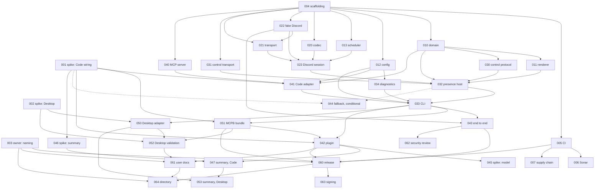

# Tickets

The work plan. One file per ticket, grouped by milestone. Each ticket states what blocks it, what it blocks, its acceptance criteria, and which Claude model and effort level to run it with.

## How to use this directory

1. Pick a ticket whose `blocked_by` tickets are all `done`.
2. Follow the `work-ticket` skill.
3. In the pull request that completes it, set the ticket's `status` to `done` and update the row in the index below.

New tickets follow [TEMPLATE.md](TEMPLATE.md) and the `write-ticket` skill. Ids are never reused.

## Status values

| Status | Meaning |
|---|---|
| `todo` | Not started |
| `in-progress` | Someone has a branch |
| `blocked` | Started, then stopped on something outside the ticket. The ticket says what |
| `done` | Merged, definition of done met |
| `conditional` | Built only if a named condition occurs. Otherwise closed as `not-needed` |
| `not-needed` | Closed without being built |

## Milestones

| Milestone | Outcome |
|---|---|
| [M0 Foundation](M0-foundation/) | Open questions answered, repository and gates in place |
| [M1 Core](M1-core/) | Sessions, rendering, configuration and scheduling, all pure and fully tested |
| [M2 Discord](M2-discord/) | A working, resilient Discord connection |
| [M3 Host](M3-host/) | Election, failover, the control channel, the command line |
| [M4 Claude Code](M4-claude-code/) | The plugin works end to end in Claude Code |
| [M5 Claude Desktop](M5-claude-desktop/) | The extension works in Claude Desktop |
| [M6 Release](M6-release/) | A published, documented, reviewed first release |

## Index

Size is rough effort for the recommended model: S is under an hour of agent time, M is a few hours, L is a day or more including review.

| Id | Title | Blocked by | Model | Effort | Size | Status |
|---|---|---|---|---|---|---|
| [CRP-001](M0-foundation/CRP-001-spike-claude-code-adapter.md) | Spike: Claude Code adapter wiring | none | Opus 5.5 | high | M | todo |
| [CRP-002](M0-foundation/CRP-002-spike-desktop-extension.md) | Spike: Claude Desktop extension lifecycle | none | Opus 5.5 | high | M | todo |
| [CRP-003](M0-foundation/CRP-003-naming-branding-discord-app.md) | Owner: naming, branding, Discord application | none | Owner, with Haiku 4.5 | n/a | S | todo |
| [CRP-004](M0-foundation/CRP-004-repo-scaffolding.md) | Repository scaffolding and toolchain | none | Sonnet 5.5 | low | S | todo |
| [CRP-005](M0-foundation/CRP-005-ci-pipeline.md) | CI pipeline and the coverage gate | 004 | Sonnet 5.5 | medium | M | todo |
| [CRP-006](M0-foundation/CRP-006-sonarqube-cloud.md) | SonarQube Cloud integration | 005 | Sonnet 5.5 | low | S | todo |
| [CRP-007](M0-foundation/CRP-007-supply-chain-policy.md) | Supply-chain policy enforcement | 005 | Sonnet 5.5 | low | S | todo |
| [CRP-010](M1-core/CRP-010-domain-model.md) | Domain model: events, sessions, registry | 004 | Sonnet 5.5 | high | M | todo |
| [CRP-011](M1-core/CRP-011-presence-renderer.md) | Presence renderer | 010 | Sonnet 5.5 | medium | M | todo |
| [CRP-012](M1-core/CRP-012-configuration.md) | Configuration | 004 | Sonnet 5.5 | medium | M | todo |
| [CRP-013](M1-core/CRP-013-update-scheduler.md) | Update scheduler | 004 | Sonnet 5.5 | high | S | todo |
| [CRP-020](M2-discord/CRP-020-discord-codec.md) | Discord IPC codec | 004 | Sonnet 5.5 | medium | S | todo |
| [CRP-021](M2-discord/CRP-021-discord-transport.md) | Discord transport: pipe and socket dialers | 004, 022 | Opus 5.5 | high | M | todo |
| [CRP-022](M2-discord/CRP-022-fake-discord-server.md) | Fake Discord IPC server for tests | 004 | Sonnet 5.5 | high | M | todo |
| [CRP-023](M2-discord/CRP-023-discord-session-manager.md) | Discord session manager | 013, 020, 021, 022 | Opus 5.5 | high | M | todo |
| [CRP-030](M3-host/CRP-030-control-protocol.md) | Control protocol | 010 | Sonnet 5.5 | medium | S | todo |
| [CRP-031](M3-host/CRP-031-control-transport.md) | Control transport and the host lock | 004 | Opus 5.5 | high | M | todo |
| [CRP-032](M3-host/CRP-032-presence-host.md) | Presence host: election, serving, failover | 010, 011, 023, 030, 031 | Opus 5.5 | xhigh | L | todo |
| [CRP-033](M3-host/CRP-033-cli.md) | Command line and composition root | 012, 032, 034, 041 | Sonnet 5.5 | medium | M | todo |
| [CRP-034](M3-host/CRP-034-diagnostics.md) | Logging and diagnostics | 012 | Sonnet 5.5 | medium | S | todo |
| [CRP-040](M4-claude-code/CRP-040-mcp-server.md) | Minimal MCP stdio server | 004 | Sonnet 5.5 | high | M | todo |
| [CRP-041](M4-claude-code/CRP-041-code-adapter.md) | Claude Code adapter | 001, 010, 012, 040 | Sonnet 5.5 | high | M | todo |
| [CRP-042](M4-claude-code/CRP-042-plugin-packaging.md) | Plugin and marketplace packaging | 001, 033, 051 | Sonnet 5.5 | medium | S | todo |
| [CRP-043](M4-claude-code/CRP-043-end-to-end-tests.md) | End-to-end tests | 022, 033 | Opus 5.5 | high | L | todo |
| [CRP-044](M4-claude-code/CRP-044-fallback-command-hooks.md) | Fallback: command hooks and standalone host | 001, 032 | Opus 5.5 | high | L | conditional |
| [CRP-045](M4-claude-code/CRP-045-spike-initial-model.md) | Spike: model name at session launch | 042 | Sonnet 5.5 | medium | S | todo |
| [CRP-046](M4-claude-code/CRP-046-spike-activity-summary.md) | Spike: activity summary written by Claude | 001 | Sonnet 5.5 | high | M | todo |
| [CRP-047](M4-claude-code/CRP-047-activity-summary.md) | Activity summary in Claude Code | 042, 046 | Sonnet 5.5 | high | M | todo |
| [CRP-050](M5-claude-desktop/CRP-050-desktop-adapter.md) | Claude Desktop adapter | 002, 033 | Sonnet 5.5 | medium | S | todo |
| [CRP-051](M5-claude-desktop/CRP-051-mcpb-bundle.md) | MCPB bundle | 001, 033 | Sonnet 5.5 | medium | S | todo |
| [CRP-052](M5-claude-desktop/CRP-052-desktop-validation.md) | Desktop validation on real machines | 002, 050, 051 | Owner, with Sonnet 5.5 | low | S | todo |
| [CRP-053](M5-claude-desktop/CRP-053-desktop-summary.md) | Activity summary in Claude Desktop Chat | 047, 050 | Sonnet 5.5 | medium | S | todo |
| [CRP-060](M6-release/CRP-060-release-pipeline.md) | Release pipeline | 003, 005, 042, 043, 051 | Sonnet 5.5 | high | M | todo |
| [CRP-061](M6-release/CRP-061-user-documentation.md) | User documentation | 003, 042, 052 | Haiku 4.5 | n/a | S | todo |
| [CRP-062](M6-release/CRP-062-security-review.md) | Security review and threat model | 043 | Opus 5.5 | high | S | todo |
| [CRP-063](M6-release/CRP-063-code-signing.md) | Code signing and notarisation | 060 | Owner, with Sonnet 5.5 | low | S | todo |
| [CRP-064](M6-release/CRP-064-directory-submission.md) | Directory submission | 003, 060, 061 | Owner, with Haiku 4.5 | n/a | S | todo |

## Dependency graph

An arrow means "must be done before".

## Suggested order

Tickets in the same wave have no dependencies on each other and can run in parallel.

| Wave | Tickets |
|---|---|
| 0 | 001, 002, 003, 004 |
| 1 | 005, 010, 012, 013, 020, 022, 031, 040, 046 |
| 2 | 006, 007, 011, 021, 030, 034, 041 |
| 3 | 023 |
| 4 | 032 |
| 5 | 033, and 044 only if CRP-001 failed |
| 6 | 043, 050, 051 |
| 7 | 042, 052, 062 |
| 8 | 060, 061, 045, 047 |
| 9 | 063, 064, 053 |

The critical path is 004, 022, 021, 023, 032, 033, 051, 042, 060. The activity summary (046, 047, 053) is deliberately off it: the first release does not wait for it. The two spikes and the owner task in wave 0 have the longest lead time and involve people, so start them first.

## Choosing a model and effort

Prices per million tokens, input and output, as listed on 2026-09-25. Check current prices before budgeting.

| Model | Input | Output | Use it for |
|---|---|---|---|
| Haiku 4.5 | $1 | $5 | Prose and mechanical edits from a complete specification. It has no effort setting |
| Sonnet 5.5 | $2 | $10 | The default. Well-specified implementation with tests |
| Opus 5.5 | $4 | $20 | Concurrency, cross-platform I/O, failure handling, security, and anything where being wrong is found late |
| Fable 5.1 | $10 | $50 | Not needed for any ticket here |

Effort levels are `low`, `medium`, `high`, `xhigh` and `max`.

| Effort | Use it for |
|---|---|
| `low` | Configuration and boilerplate where the ticket leaves no decisions |
| `medium` | Ordinary implementation against clear acceptance criteria |
| `high` | State machines, protocol code, test harnesses, anything with subtle edge cases |
| `xhigh` | Only CRP-032, where election and failover races are the main risk |
| `max` | Not used |

Rules for keeping cost down without losing quality:

1. **Do not upgrade a model to compensate for a vague ticket.** Fix the ticket.
2. **Escalate on evidence.** If a ticket at its recommended setting fails review twice for the same kind of reason, rerun at the next effort level, then the next model.
3. **Keep the session focused on one ticket.** Load only the documents the ticket links.
4. **Review is cheaper than rework.** Run `/code-review` on every pull request. For the Opus tickets, review with Opus as well.
5. **Spikes are time-boxed.** A spike that has not answered its questions in its box stops and reports what it found.

By this plan twenty-three tickets run on Sonnet 5.5, nine on Opus 5.5 (one of them conditional), one on Haiku 4.5, and four are owner tasks with light model assistance.

## Owner actions

These need a person with the owner's accounts. Nothing else in the plan does.

| Action | Ticket |
|---|---|
| Decide names; create the Discord application and upload artwork | CRP-003 |
| Create the SonarQube Cloud organisation and project; add the `SONAR_TOKEN` secret | CRP-006 |
| Run the spike prototypes inside real Claude Code and Claude Desktop on Windows, and on a Mac if one is available | CRP-001, CRP-002 |
| Confirm presence in a real Discord client on real machines | CRP-052 |
| Decide whether to pay for signing and notarisation | CRP-063 |
| Submit to directories | CRP-064 |
